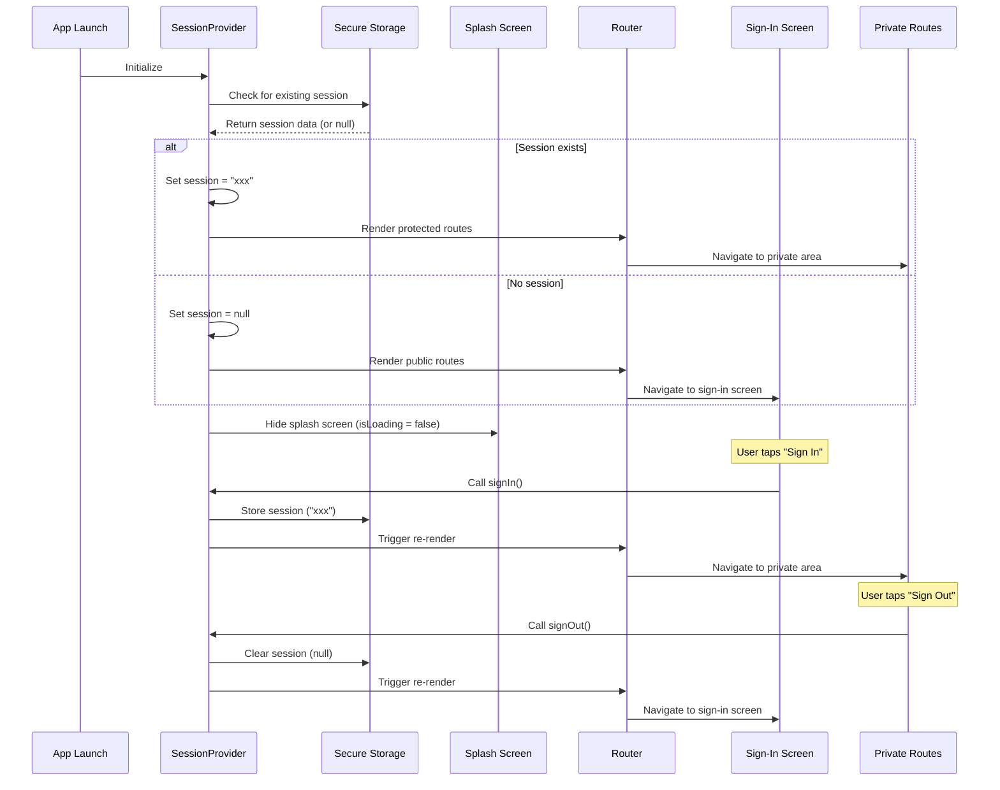

# Coin Copilot - Project Documentation

## Table of Contents
1. [Project Overview](#project-overview)
2. [Project Structure](#project-structure)
3. [Architecture](#architecture)
4. [Authentication System](#authentication-system)
5. [Screen Navigation & Routing](#screen-navigation--routing)
6. [Features & Functionality](#features--functionality)
7. [Development Guidelines](#development-guidelines)

## Project Overview

**Coin Copilot** is a React Native mobile application built with Expo Router, designed to provide cryptocurrency management and tracking capabilities. The app follows a modern architecture pattern with secure authentication and protected routing.

### Tech Stack
- **Framework**: React Native with Expo
- **Navigation**: Expo Router (file-based routing)
- **State Management**: React Context API
- **Storage**: Expo Secure Store (native) / localStorage (web)
- **Language**: TypeScript
- **Platform Support**: iOS, Android, Web

## Project Structure

```
coin-copilot/
├── src/
│   └── app/
│       ├── _layout.tsx              # Root layout with auth provider
│       ├── context/
│       │   └── authContext.tsx      # Authentication context
│       ├── hooks/
│       │   └── useSecureStorage.ts  # Secure storage hook
│       ├── sign-in.tsx              # Sign-in screen
│       ├── splash.tsx               # Splash screen controller
│       └── (private)/               # Protected routes
│           ├── _layout.tsx          # Private layout
│           └── index.tsx            # Home screen
├── app-example/                     # Example components
├── assets/                          # Static assets
├── package.json
└── tsconfig.json
```

## Architecture

### Core Architecture Principles
1. **File-based Routing**: Using Expo Router for intuitive navigation structure
2. **Context-based State Management**: React Context for global state (authentication)
3. **Protected Routes**: Route-level protection based on authentication status
4. **Cross-platform Storage**: Secure storage for native platforms, localStorage for web
5. **TypeScript**: Full type safety throughout the application

### Key Architectural Components

#### 1. Authentication Context (`authContext.tsx`)
- Centralized authentication state management
- Provides session management functions
- Handles loading states during authentication checks

#### 2. Secure Storage Hook (`useSecureStorage.ts`)
- Cross-platform storage abstraction
- Uses Expo Secure Store for native platforms
- Falls back to localStorage for web platform
- Handles async storage operations

#### 3. Route Protection System
- Stack.Protected components for conditional rendering
- Automatic redirection based on authentication status
- Splash screen management during loading

## Authentication System

### Overview
The authentication system uses a simple session-based approach with secure storage for persistence across app sessions.

### Authentication Flow

#### Components Involved
1. **SessionProvider**: Context provider managing authentication state
2. **useSession**: Hook for accessing authentication state and methods
3. **useSecureStorage**: Hook for secure storage operations
4. **SplashScreenController**: Manages splash screen visibility during loading

#### Authentication States
- **Loading**: Initial state while checking stored session
- **Authenticated**: User has valid session
- **Unauthenticated**: No valid session found

### Authentication Sequence Flow



### Authentication Methods

#### `signIn()`
- Sets session to a hardcoded value ("xxx")
- Stores session in secure storage
- Triggers route re-evaluation

#### `signOut()`
- Clears session (sets to null)
- Removes session from secure storage
- Triggers route re-evaluation

#### Session Persistence
- **Native Platforms**: Uses Expo Secure Store
- **Web Platform**: Uses localStorage
- **Key**: "session"
- **Value**: Session token or null

## Screen Navigation & Routing

### Route Structure

#### Public Routes (Unauthenticated)
- `/sign-in` - Sign-in screen

#### Protected Routes (Authenticated)
- `/(private)/` - Private area root
  - `/(private)/index` - Home screen

### Navigation Logic

#### Root Layout (`_layout.tsx`)
```typescript
function RootNavigator() {
  const { session } = useSession();
  return (
    <Stack>
      <Stack.Protected guard={!!session}>
        <Stack.Screen name="(private)" />
      </Stack.Protected>

      <Stack.Protected guard={!session}>
        <Stack.Screen name="sign-in" />
      </Stack.Protected>
    </Stack>
  )
}
```

#### Route Protection Mechanism
- **`Stack.Protected guard={!!session}`**: Shows private routes only when session exists
- **`Stack.Protected guard={!session}`**: Shows public routes only when no session
- **Automatic Redirection**: Routes automatically switch based on authentication state

### Screen Transitions

#### Sign-In Flow
1. User taps "Sign In" button
2. `signIn()` method called
3. Session stored in secure storage
4. Router re-evaluates route guards
5. User redirected to `/(private)/index`

#### Sign-Out Flow
1. User taps "Sign Out" button
2. `signOut()` method called
3. Session cleared from storage
4. Router re-evaluates route guards
5. User redirected to `/sign-in`

## Features & Functionality

### Current Features
1. **Authentication System**
   - Session-based authentication
   - Secure storage integration
   - Automatic route protection

2. **Navigation System**
   - File-based routing with Expo Router
   - Protected route system
   - Splash screen management

3. **Cross-Platform Support**
   - iOS, Android, and Web compatibility
   - Platform-specific storage handling

### Planned Features
*To be documented as features are implemented*

## Development Guidelines

### Code Organization
- **Context**: Global state management (`src/app/context/`)
- **Hooks**: Reusable logic (`src/app/hooks/`)
- **Screens**: Route components (`src/app/`)
- **Components**: Reusable UI components (`app-example/components/`)

### File Naming Conventions
- **Screens**: PascalCase (`SignIn.tsx`)
- **Hooks**: camelCase with "use" prefix (`useSecureStorage.ts`)
- **Context**: PascalCase with "Context" suffix (`authContext.tsx`)

### TypeScript Guidelines
- Use strict type checking
- Define interfaces for complex objects
- Use proper typing for React components and hooks

### Security Considerations
- Sensitive data stored in secure storage
- Session tokens handled securely
- Cross-platform storage abstraction

---

*This documentation will be updated as new features and functionality are added to the project.*
