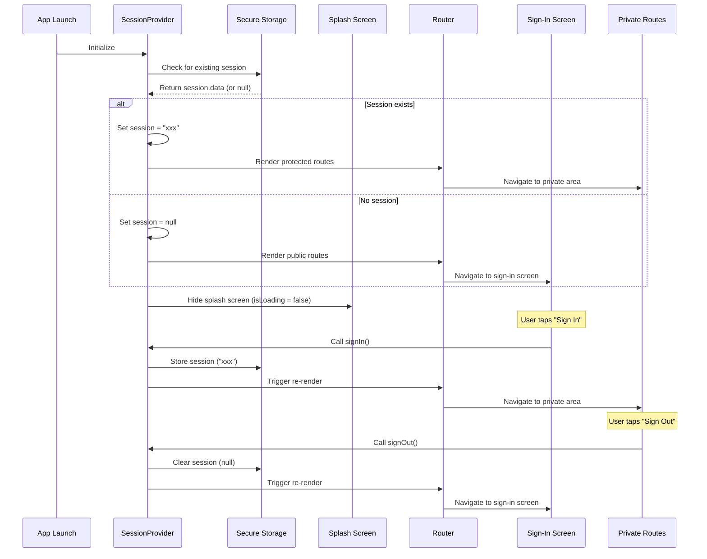

# Coin Copilot - Project Documentation

## Table of Contents
1. [Project Overview](#project-overview)
2. [Project Structure](#project-structure)
3. [Architecture](#architecture)
4. [Authentication System](#authentication-system)
5. [Screen Navigation & Routing](#screen-navigation--routing)
6. [Features & Functionality](#features--functionality)
7. [Development Guidelines](#development-guidelines)

## Project Overview

**Coin Copilot** is a React Native mobile application built with Expo Router, designed to provide cryptocurrency management and tracking capabilities. The app follows a modern architecture pattern with secure authentication and protected routing.

### Tech Stack
- **Framework**: React Native with Expo
- **Navigation**: Expo Router (file-based routing)
- **State Management**: React Context API
- **Backend**: Supabase (Authentication, Database)
- **Database**: PostgreSQL (via Supabase)
- **Storage**: Expo Secure Store (native) / localStorage (web)
- **Language**: TypeScript
- **Platform Support**: iOS, Android, Web

## Project Structure

```
coin-copilot/
├── src/
│   └── app/
│       ├── _layout.tsx              # Root layout with auth provider
│       ├── context/
│       │   └── authContext.tsx      # Authentication context (Supabase)
│       ├── hooks/
│       │   └── useSecureStorage.ts  # Secure storage hook
│       ├── lib/
│       │   ├── supabase.ts          # Supabase client configuration
│       │   ├── database.ts          # Database helper functions
│       │   ├── lunchMoneyApi.ts     # Lunch Money API integration
│       │   └── utils.ts             # Utility functions (hash, etc.)
│       ├── sign-in.tsx              # Sign-in screen
│       ├── splash.tsx               # Splash screen controller
│       └── (private)/               # Protected routes
│           ├── _layout.tsx          # Private layout
│           └── index.tsx            # Home screen
├── supabase/
│   ├── migrations/                  # Database migrations
│   │   └── 20251017223109_initial_setup.sql
│   └── config.toml                  # Supabase configuration
├── app-example/                     # Example components
├── assets/                          # Static assets
├── SUPABASE_SETUP.md                # Database setup instructions
├── package.json
└── tsconfig.json
```

## Architecture

### Core Architecture Principles
1. **File-based Routing**: Using Expo Router for intuitive navigation structure
2. **Context-based State Management**: React Context for global state (authentication)
3. **Protected Routes**: Route-level protection based on authentication status
4. **Cross-platform Storage**: Secure storage for native platforms, localStorage for web
5. **TypeScript**: Full type safety throughout the application

### Key Architectural Components

#### 1. Authentication Context (`authContext.tsx`)
- Centralized Supabase authentication state management
- Provides session management functions (`signIn`, `signOut`)
- Handles loading states during authentication checks
- Listens to Supabase auth state changes
- Fetches and stores Lunch Money API key from database

#### 2. Supabase Client (`supabase.ts`)
- Configured Supabase client instance
- Uses expo-sqlite/localStorage adapter for session storage
- Auto-refresh tokens enabled
- Persistent sessions across app restarts

#### 3. Database Helpers (`database.ts`)
- `saveLunchMoneyApiKey()`: Saves API key to database with RLS
- `getLunchMoneyApiKey()`: Retrieves API key for current user
- `deleteLunchMoneyApiKey()`: Removes API key from database
- All operations protected by Row Level Security policies

#### 4. Utility Functions (`utils.ts`)
- `simpleHash()`: Deterministic hash function for API keys
- `generateHiddenEmail()`: Creates hidden email from API key
- Used to maintain consistent user identity across devices

#### 5. Secure Storage Hook (`useSecureStorage.ts`)
- Cross-platform storage abstraction
- Uses Expo Secure Store for native platforms
- Falls back to localStorage for web platform
- Handles async storage operations

#### 6. Route Protection System
- Stack.Protected components for conditional rendering
- Automatic redirection based on Supabase session status
- Splash screen management during loading

## Authentication System

### Overview
The authentication system uses Supabase Auth with a hidden email strategy for API key-based authentication. Users authenticate using their Lunch Money API key without needing to provide an email or password.

### How It Works

1. **User enters API key** → App generates hidden email like `lm_abc123@coincopilot.app`
2. **First time**: Creates Supabase account with hidden email + API key as password
3. **Returning user (same/different device)**: Signs in with same hidden email
4. **API key saved in database** with proper RLS policies
5. **Multi-device support**: Same API key = same account across all devices ✅

### Authentication Flow

#### Components Involved
1. **SessionProvider**: Context provider managing Supabase authentication state
2. **useSession**: Hook for accessing authentication state and methods
3. **Supabase Auth**: Handles user authentication and session management
4. **Database (user_api_keys table)**: Stores encrypted Lunch Money API keys
5. **SplashScreenController**: Manages splash screen visibility during loading

#### Authentication States
- **Loading**: Initial state while checking Supabase session
- **Authenticated**: User has valid Supabase session and API key
- **Unauthenticated**: No valid session found

### Authentication Sequence Flow



### Authentication Methods

#### `signIn(apiKey: string)`
1. Validates the Lunch Money API key (mock validation for now)
2. Generates hidden email from API key using hash: `lm_${hash(apiKey)}@coincopilot.app`
3. Attempts to sign in with Supabase Auth (email + API key as password)
4. If user doesn't exist, creates new Supabase account automatically
5. Saves API key to `user_api_keys` database table
6. Updates local state with Supabase session
7. Navigation happens automatically via auth state change

#### `signOut()`
- Calls `supabase.auth.signOut()` to clear Supabase session
- Clears local state (session and API key)
- Triggers route re-evaluation via auth state listener
- Redirects to sign-in screen

#### Session Persistence
- **Session Management**: Supabase Auth handles session persistence
- **Storage**: Supabase session stored in localStorage (via expo-sqlite adapter)
- **API Key Storage**: Encrypted in Supabase database with RLS
- **Multi-device**: Same API key authenticates to same account across devices

## Screen Navigation & Routing

### Route Structure

#### Public Routes (Unauthenticated)
- `/sign-in` - Sign-in screen

#### Protected Routes (Authenticated)
- `/(private)/` - Private area root
  - `/(private)/index` - Home screen

### Navigation Logic

#### Root Layout (`_layout.tsx`)
```typescript
function RootNavigator() {
  const { session } = useSession();
  return (
    <Stack>
      <Stack.Protected guard={!!session}>
        <Stack.Screen name="(private)" />
      </Stack.Protected>

      <Stack.Protected guard={!session}>
        <Stack.Screen name="sign-in" />
      </Stack.Protected>
    </Stack>
  )
}
```

#### Route Protection Mechanism
- **`Stack.Protected guard={!!session}`**: Shows private routes only when session exists
- **`Stack.Protected guard={!session}`**: Shows public routes only when no session
- **Automatic Redirection**: Routes automatically switch based on authentication state

### Screen Transitions

#### Sign-In Flow
1. User taps "Sign In" button
2. `signIn()` method called
3. Session stored in secure storage
4. Router re-evaluates route guards
5. User redirected to `/(private)/index`

#### Sign-Out Flow
1. User taps "Sign Out" button
2. `signOut()` method called
3. Session cleared from storage
4. Router re-evaluates route guards
5. User redirected to `/sign-in`

## Database Schema

### `user_api_keys` Table
Stores Lunch Money API keys for authenticated users with Row Level Security.

**Columns:**
- `id` (UUID): Primary key
- `user_id` (UUID): References auth.users, unique
- `lunch_money_api_key` (TEXT): Encrypted API key, unique
- `created_at` (TIMESTAMPTZ): Record creation timestamp
- `updated_at` (TIMESTAMPTZ): Auto-updated on changes

**RLS Policies:**
- Users can only SELECT/INSERT/UPDATE/DELETE their own records
- Protected by `auth.uid() = user_id` policy

**Indexes:**
- `idx_user_api_keys_user_id`: Fast lookups by user
- `idx_user_api_keys_lunch_money_api_key`: API key validation

**Triggers:**
- Auto-update `updated_at` timestamp on record modification

### Database Migrations
Managed via Supabase CLI in `supabase/migrations/` directory.

**Setup:**
```bash
npm run db:link    # Link to remote Supabase project
npm run db:push    # Apply migrations to database
npm run db:status  # Check migration status
```

See `SUPABASE_SETUP.md` for detailed instructions.

## Features & Functionality

### Current Features
1. **Authentication System**
   - API key-based authentication via Supabase
   - Hidden email strategy for user identity
   - Multi-device support
   - Secure storage integration
   - Automatic route protection

2. **Navigation System**
   - File-based routing with Expo Router
   - Protected route system
   - Splash screen management

3. **Cross-Platform Support**
   - iOS, Android, and Web compatibility
   - Platform-specific storage handling

4. **Database Integration**
   - Supabase PostgreSQL database
   - Row Level Security policies
   - Automated migrations
   - Encrypted API key storage

### Planned Features
- Lunch Money API integration (fetch transactions, budgets, etc.)
- Transaction tracking and visualization
- Budget management
- Cryptocurrency portfolio tracking

## Development Guidelines

### Code Organization
- **Context**: Global state management (`src/app/context/`)
- **Hooks**: Reusable logic (`src/app/hooks/`)
- **Lib**: Utility functions and integrations (`src/app/lib/`)
- **Screens**: Route components (`src/app/`)
- **Components**: Reusable UI components (`app-example/components/`)
- **Migrations**: Database schema changes (`supabase/migrations/`)

### File Naming Conventions
- **Screens**: PascalCase (`SignIn.tsx`)
- **Hooks**: camelCase with "use" prefix (`useSecureStorage.ts`)
- **Context**: PascalCase with "Context" suffix (`authContext.tsx`)
- **Lib files**: camelCase (`database.ts`, `lunchMoneyApi.ts`)
- **Migrations**: Timestamp + description (`20251017223109_initial_setup.sql`)

### TypeScript Guidelines
- Use strict type checking
- Define interfaces for complex objects
- Use proper typing for React components and hooks
- Import types from `@supabase/supabase-js` when needed

### Database Guidelines
- **Never bypass RLS**: Always use Supabase client, never service role key in client
- **Test migrations locally first**: Use local Supabase instance before pushing
- **One migration per feature**: Keep migrations focused and atomic
- **No down migrations**: Always write forward-compatible schemas
- **Document schema changes**: Add comments in migration files

### Security Considerations
- API keys encrypted and stored with RLS in Supabase
- Session tokens managed by Supabase Auth
- Hidden email strategy prevents user email collection
- Cross-platform storage abstraction
- Never commit `.env.local` or Supabase service role keys

### Environment Variables
Required in `.env.local`:
```
EXPO_PUBLIC_SUPABASE_URL=https://your-project.supabase.co
EXPO_PUBLIC_SUPABASE_ANON_KEY=your-anon-key
```

### Working with Database
```bash
# Link to remote project (one-time setup)
npm run db:link

# Push migrations to remote
npm run db:push

# Check migration status
npm run db:status
```

---

*This documentation will be updated as new features and functionality are added to the project.*
